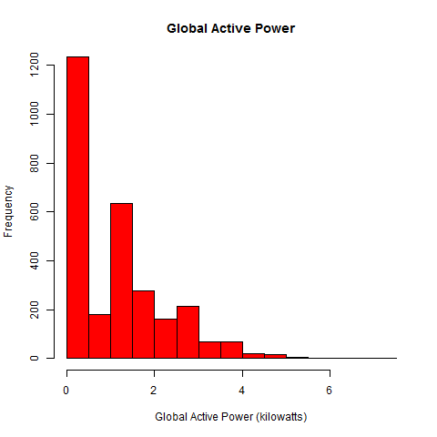
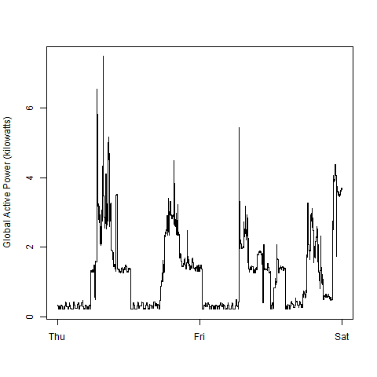
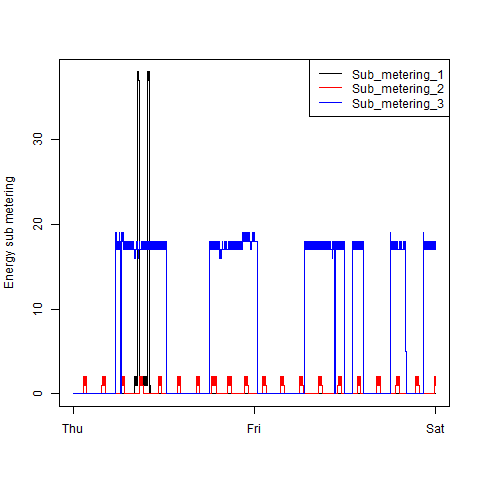
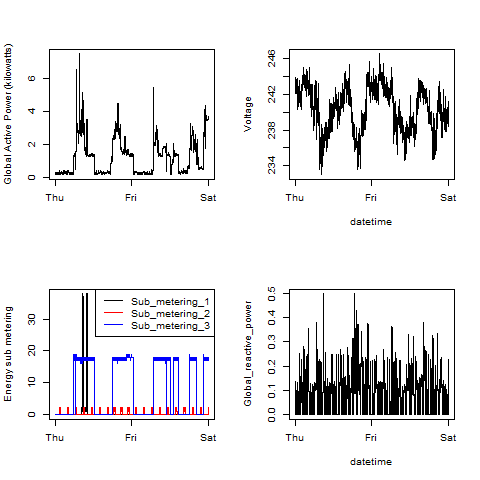

## Exploratory Data Analysis Course Project 1

This repository contains the required plots 1-4 and the scripts plot[1-4].R that create the plots.
To run the scripts, please make sure that the original dataset is unzipped and that the current working directory contains a file called "household_power_consumption.txt".

## What the scripts do

Each script loads the data from "household_power_consumption.txt", subsets them to extract the data for the dates 2007-02-01 and 2007-02-02.
Then the date and time variables are converted into POSIX dates. Additional conversion is done to ensure that the other variables are numeric.
After that, a png is opened as a graphic device and the data is plotted. Each script also stores the current locale and restores it after the plot is done.

### Plot 1

 

### Plot 2

 

### Plot 3

 

### Plot 4

 

